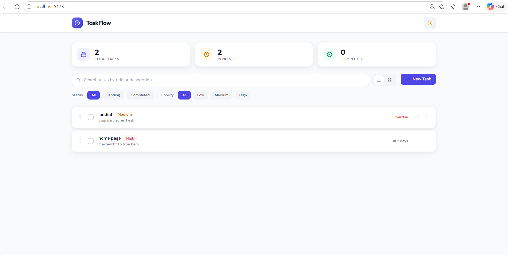
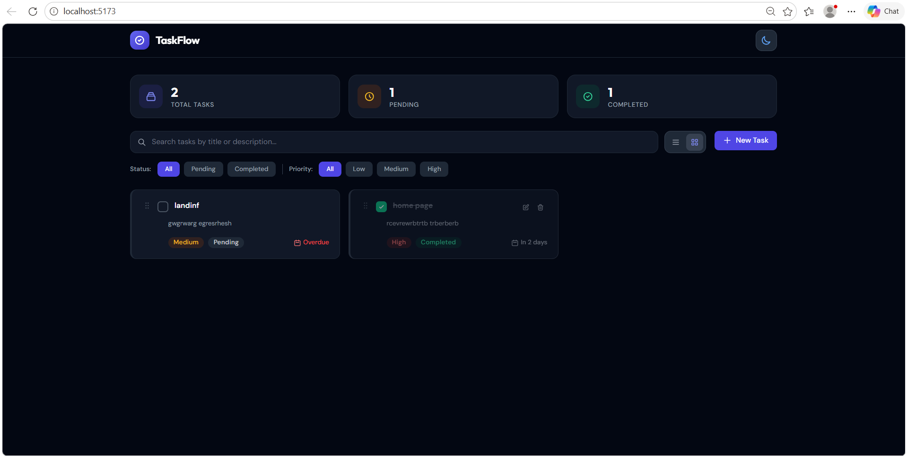
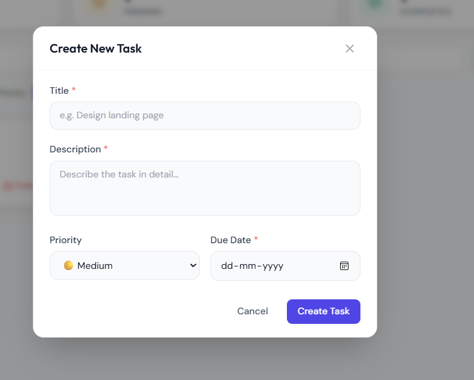
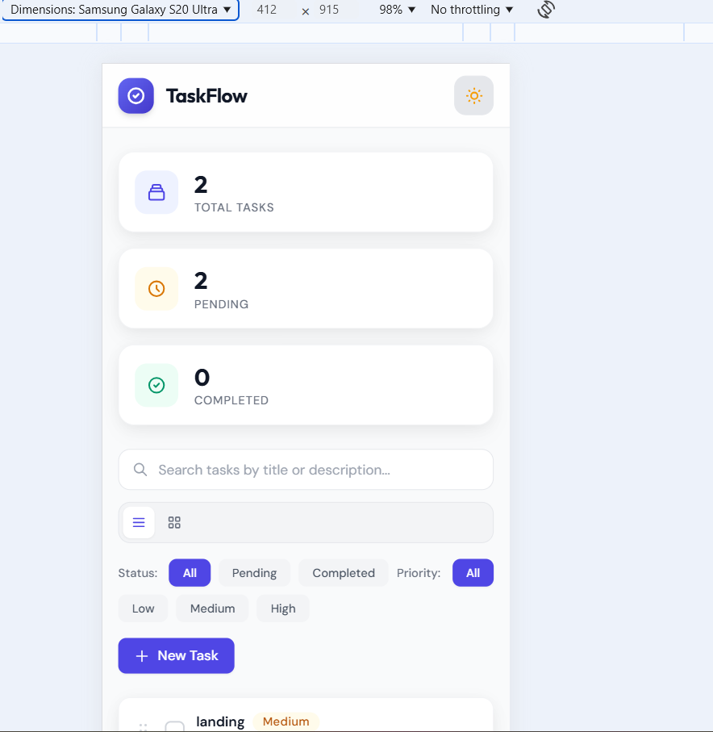

# TaskFlow — Task Management Dashboard

## Features

### Core Features
- **Task Creation** — Create tasks with title, description, priority (Low/Medium/High), and due date
- **Task Display** — View tasks in **List View** or **Card View** (toggle-based)
- **Edit Tasks** — Edit any task via a modal-based editor
- **Delete Tasks** — Delete with confirmation dialog to prevent accidental removal
- **Task Status** — Toggle tasks between Pending/Completed with visual indicators (strikethrough, opacity, color coding)
- **Search & Filter** — Real-time search by title/description; filter by status and priority
- **Task Counts** — Dashboard stats showing Total, Pending, and Completed task counts
- **Data Persistence** — All data stored in `localStorage` and survives page refresh
- **Responsive Design** — Fully responsive across desktop, tablet, and mobile

### Bonus Features
- **Card View Toggle** — Switch between list and grid card layouts
- **Dark / Light Mode** — Toggle with animated sun/moon icon; persists preference
- **Drag-and-Drop Reordering** — Reorder tasks by dragging; built as a **reusable component**
- **Smooth Animations** — Entrance animations, hover micro-interactions, modal transitions
- **TypeScript** — Fully typed with strict mode enabled
- **Unit Tests** — Jest + React Testing Library tests for utilities and components

---

## Tech Stack

| Technology | Purpose |
|---|---|
| **Vite** | Build tool & dev server |
| **React 18** | UI framework |
| **TypeScript** | Type safety |
| **Tailwind CSS 3** | Utility-first styling |
| **React Query (TanStack)** | API-ready data layer |
| **Jest** | Unit testing |
| **React Testing Library** | Component testing |
| **uuid** | Unique ID generation |

---

## Project Structure

```
src/
├── components/
│   ├── common/                # Reusable UI components
│   │   ├── DragAndDrop/       # ★ Reusable drag-and-drop component
│   │   │   ├── DragAndDrop.tsx # Main component (heavily commented)
│   │   │   └── index.ts       # Barrel export
│   │   ├── Badge.tsx          # Status/priority pill
│   │   ├── Button.tsx         # Multi-variant button
│   │   ├── ConfirmDialog.tsx  # Delete confirmation
│   │   ├── Modal.tsx          # Accessible modal dialog
│   │   └── index.ts           # Barrel export
│   ├── layout/
│   │   └── Header.tsx         # App header with logo + theme toggle
│   ├── tasks/
│   │   ├── Dashboard.tsx      # Main page orchestrator
│   │   ├── EmptyState.tsx     # No-tasks placeholder
│   │   ├── FilterBar.tsx      # Search + filter + view toggle
│   │   ├── TaskCard.tsx       # Card view item
│   │   ├── TaskForm.tsx       # Create/Edit form
│   │   ├── TaskList.tsx       # List wrapper with DnD
│   │   ├── TaskListItem.tsx   # List view item
│   │   └── TaskStats.tsx      # Count cards
│   └── theme/
│       └── ThemeToggle.tsx    # Dark/light mode button
├── context/
│   └── ThemeContext.tsx        # Theme state provider
├── hooks/
│   ├── useLocalStorage.ts     # Generic localStorage sync hook
│   └── useTasks.ts            # Task CRUD + reorder logic
├── types/
│   └── task.ts                # TypeScript interfaces & enums
├── utils/
│   └── taskUtils.ts           # Pure helper functions
├── App.tsx                    # Root component
├── main.tsx                   # Entry point
└── index.css                  # Global styles + Tailwind

__tests__/
├── taskUtils.test.ts          # Utility function tests
└── components.test.tsx        # Component rendering tests
```

---


## Design Decisions

1. **Component Architecture** — Small, focused components with single responsibilities. All reusable components are in `common/` and can be used independently.

2. **State Management** — React hooks + Context API (no Redux needed for this scale). `useLocalStorage` provides persistence, `useTasks` encapsulates all CRUD logic.

3. **Styling** — Tailwind CSS with a custom design system (brand colors, custom fonts, animations). Dark mode uses Tailwind's `class` strategy with a context provider.

4. **TypeScript Strict Mode** — All types are explicit, no `any` usage. Enums for Priority and Status ensure type safety across the app.

6. **Accessibility** — Modals trap focus, use `aria-modal`, close on Escape. Buttons have `aria-label`. List items have proper ARIA roles.

---

## Setup & Installation

### Steps

```bash
# 1. Extract the ZIP and navigate to the project
cd task-management-dashboard

# 2. Install dependencies
npm install

# 3. Start the development server
npm run dev

# 4. Open in browser
# → http://localhost:5173
```

### Other Commands

```bash
# Build for production
npm run build

# Run tests
npm test

```

---

## Screenshots



### Light Mode — List View
> The default view showing all tasks in a clean list layout with status counts.



### Dark Mode — Card View
> Toggle to dark mode and card view for a grid-based layout with colored priority borders.


### Create Task Modal
> Modal dialog with validated form fields for title, description, priority, and due date.



### Mobile Responsive
> Fully responsive layout that stacks gracefully on smaller screens.

---

## Deployment

The app is deployed and accessible at:

### Netlify (Live URL)
 https://task-management-product.netlify.app/

---

